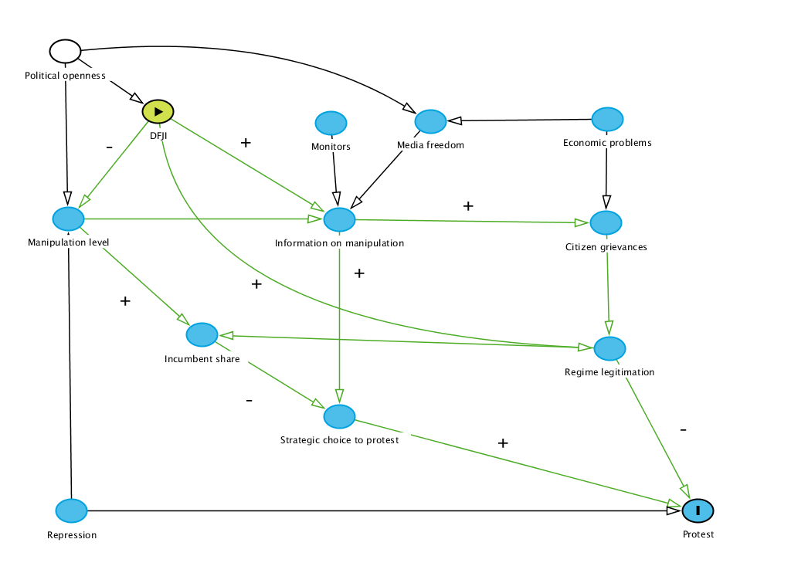

Just as many less democratic states have enshrined multiparty elections into their political systems in the post-Cold War period, many have simultaneously experimented with varying degrees of judicial independence. A growing research tradition identifies various benefits that more independent courts can provide for non-democratic ruling parties, including regime legitimation, monitoring of discontent and of abuses by low-level officials, protecting investments, and more [@Moustafa2008]. As a result of these benefits, even many of the most authoritarian states have added de jure protections for courts's autonomy to their laws and constitutions [Staton2020]. At the same time, just like elections, more independent courts create an unpredictable connection between state and society; more open courts create opportunities for legal mobilization against the regime, with uncertain consequences. Consequently, de-democratizing states may act to restrain previously independent courts.

These dynamics can be seen across Europe, from legal contestation in Ukraine and Russia [@popova2020politicized] to the erosion of judicial independence in Poland and Hungary. In the latter case, the ruling Law and Justice Party (PiS) has taken significant steps to weaken judicial independence since 2015. These include increasing the legislature's influence over judicial appointments, stacking the judicial-nomination council with ruling-party allies, and the creation of a disciplinary chamber under the control of the Ministry of Justice. This disciplinary body can impose salary cuts, or even dismissal, on judges found to have in vaguely-defined "political activity"---which includes discussions of judicial independence and the PiS reforms themselves [@Duncan2020]. The situation has raised sufficient alarm among other EU member states that the European Commission has announced an infringement procedure against Poland, for flouting EU law while undermining its national courts' autonomy (https://www.dw.com/en/eu-starts-new-legal-action-against-poland-over-rule-of-law/a-60220102). Similarly, in Hungary, the parliamentary majority created a new National Office for the Judiciary in 2012, with broad powers to appoint and promote judges (https://www.venice.coe.int/Newsletter/NEWSLETTER_2012_02/1_HUN_EN.html). 


# Literature review

Several prominent models of electoral manipulation argue that the risk of mass post-election protest helps restrain incumbents who might otherwise prefer larger levels of manipulation [@magaloni2010; @Little2015; @Little2012; @birch2011; @Fearon2011]. Building on this logic, researchers have proposed that third-party institutions---like election monitors [@Hyde2014; @daxecker2012], civil society groups [@birch2017getting], and courts [@Chernykh2015]---can reduce manipulation and increase protest risk by revealing information about electoral malfeasance. Chernykh and Svolik, in particular, argue that by revealing information about manipulation, even moderately independent courts can increase the risk of protest against manipulated elections (thus deterring manipulation), while also reducing the risk that opposition groups mistakenly protest clean elections. This result is in keeping with the argument that electoral protests are the outcome of bargaining failure among incumbents and opposition groups, which are worsened in low-information environments [@Beaulieu2014a].  

Despite courts' connection to one of the most prominent theorized mechanisms for limiting electoral manipulation---protest risk---the relationship between judicial independence and post-election protest is conceptually and empirically muddled. Chernykh [-@chernykh2014] and Eisenstadt [-@eisenstadt_courting_2003] both find no effect for judicial independence on the likelihood of protest. This at least partially calls into question the prediction that more independent courts make protest more likely in the presence of election manipulation.

Judicial independence is understood as courts' ability to come to their own conclusions on the cases before them, without undue influence from outside actors [@Linzer2015]. At the same time that many non-democratic regimes have adopted the institution of (unfairly biased) multiparty elections [@magaloni2010political], many have also made efforts to improve the autonomy of their courts under some circumstances [@Staton2020]. Non-democratic governments do this due to the variety of benefits that independent courts can provide to such regimes. These include enforcing contracts and protecting investments [@Moustafa2008], gathering information on citizen grievances [@rios-figueroa_justice_2017], opposition groups [@Sievert2018], and on lower-level officials [@Ginsburg2008], police rival elite groups [@Ma2017], and---crucially---help legitimate the regime and its other institutions [@moustafa_tamir_law_2008; @Whiting2017].

# Theory

Judicial independence is thought to influence the decision to protest in two broad ways: by affecting citizens' grievances, and by shaping opposition parties' incentives to call their supporters to the streets. Within each of these general effects, at least two channels of influence have been hypothesized. On the strategic side, independent courts may have two effects.  First, greater judicial independence should lead to reduced election manipulation in less competitive settings [@Harvey2022]. Reduced manipulation should result in a smaller margin of victory for incumbents, which in turn should increase the likelihood of protest [@simpser2013; @Brancati2016; @Chernykh2015]. This can be called the margin-of-victory channel. 

Second, there is the mechanism proposed by Chernykh and Svolik [-@Chernykh2015], in which independent courts reveal more information about electoral manipulation. Opposition parties use information from the courts to estimate their true popularity, increasing the risk of protest by opposition actors when manipulation is high. This might be called the information-strategy channel. The effects of these channels point in the same direction, though under different circumstances. On the one hand, independent courts should improve opposition parties' electoral results (without conditioning on manipulation level), increasing the odds of opposition protest. On the other hand, when manipulation is high, courts reveal this information to opposition parties, making those parties more likely to challenge election outcomes in the streets. Chernykh and Svolik note that other institutions, like election monitors, can have this same informational effect, so I expect that courts' informational role will be most noticeable when election observers are absent. 


On the grievance side, courts also perform two functions that may influence protest likelihood. First, researchers have argued that election manipulation acts as a focal point for citizens' existing grievances with the regime, creating an opportunity for individuals with discrete complaints to register their displeasure at the same time [@tucker2007; @Brancati2016]. In other words, citizens with diverse complaints may be united in the post-electoral moment by information that the election was rigged---a unifying grievance. To the extent that courts reveal information about electoral malfeasance, independent courts may contribute to this sense of post-election grievance---increasing the risk of protest. This effect could be called the information-grievance channel. 

However, one of the central functions of independent judiciaries outside of liberal democracies is to create mechanism through which citizens grievances can be addressed [@Whiting2017; @Solomon2007; @Hilbink2007d]. Relatively impartial courts create an opportunity for citizens to resolve grievances against the state and against other individuals who may be more powerful or influential. For example, survey-experimental data show that citizens of several Middle Eastern non-democracies were more willing to engage in legal action to address their grievances when they believe courts are more independent and assertive [@Schaaf2021]. Moreover, the belief that procedures are generally followed impartially can bolster the state's claim to legitimacy [@Gerschewski2013], increasing citizens' trust in authority and willingness to abide by political outcomes [@Grimes2006]. Evidence from European democracies suggests that that de facto independence is key for such judgments [@Buhlmann2011]. Taken together, greater de facto judicial independence ought to reduce protest risk, both by creating a channel for the state to address citizens' general grievances and by offering an alternative venue to the street for addressing specific electoral concerns. I call this last effect the legitimation channel.

{# .class width=75% height=75%}


Figure 1 illustrates the relationship between de facto judicial independence and post-election protest as a directed acyclic graph [@pearl2000causality]. Plus- and minus signs in the figure indicate the theorized direction of specific channels of the relationship. For example, greater judicial independence is predicted to improve the regime's legitimacy, reducing citizens' grievances, which in turn have a positive effect on the risk of protest. Taken together, this channel suggests that greater independence will reduce protest risk by ameliorating grievances. As the figure shows, full effect of judicial independence is multi-faceted, and the the direction and size of overall effect is likely to be dependent on factors that vary across cases and over time. De facto judicial independence may increase the risk of protest by exposing information on manipulation, for example, but this effect is conditional on other sources of such information (e.g. election monitors) and on the broader media environment to broadcast such claims. Court cases may indeed be a very prominent source of information on election integrity for opposition parties, for example, but the widespread presence of election monitors should reduce courts' importance in this regard. Likewise, a closed media environment makes it difficult for citizens to access information about low-quality elections.

The relationship between judicial independence and electoral protest is likely to be unclear, in part, because there are at least four distinct channels through which the former can effect the latter. While three of the four effects ought to make protest more likely, they are predicted to do so under distinct circumstances. Moreover, one of these channels is expected to reduce the likelihood of electoral protest. There should be, as a result, no *a priori* expectation as to the direction of the overall effect. If, for example, the grievance-based channels do most of the work, we might expect judicial independence to reduce the overall risk to protest: reduced manipulation at the front end limits the unifying grievance of a flawed election, while the legitimation channel helps defuse citizens' more diverse grievances. Nevertheless, given the conventional wisdom that independent courts should increase protest risk, I phrase Hypothesis 1 as follows.

>H1 (Overall effect): Without conditioning on the level of manipulation, increased judicial independence is expected to increase the risk of post-election protest.

>H2 (Information-strategic channel): When manipulation is high and alternative sources of information are scarce, increased judicial independence should increase the risk of protest.

>H3 (Margin of victory channel): Controlling for legitimation and grievances, judicial independence should increase the risk of protest.

>H4 (Legitimation channel): Controlling for the level of electoral manipulation, greater judicial independence should reduce the risk of protest when overall grievances are high.

>H5 (Information-grievance channel): Conditional on the level of manipulation, increased judicial independence should increase the risk of protest when greivances are high.


# Data and methods

These hypotheses are tested using data from three datasets: NELDA [@hyde2012], V-Dem version 11.1 [@vdem11.1], and the Electoral Contention and Violence (ECAV) dataset [@Daxecker2019]. The unit of observation for this study is an election period as recorded in NELDA, which counts all national elections between 1945 and 2015. This framework prevents selecting on the dependent variable, by capturing both protested and non-protested elections. NELDA also includes a variable indicating elections in which incumbents lost; as this study is focused on protest against ostensibly victorious incumbents, I use this variable to filter out elections which the opposition won. I further limit the sample to regimes coded as electoral autocracies or electoral democracies in V-Dem. This excludes closed autocracies (where no national elections are held) and liberal democracies (where electoral integrity and rule of law are both high). Finally, the date range is limited by the availability of data on protest from ECAV, as discussed below, which runs from 1990 to 2012. The resulting dataset includes 647 election-period observations.

The dependent variable for this study is taken from ECAV, which records protests and other contentious actions from six months before to three months after an election. For this study, I include protests only, excluding violent acts like shootings, bombings, and coups. ECAV data is in event-day format. To capture this variation, I take the sum of all post-election protest-days as the dependent variable. The result is a count variable ranging from 0 to 90, with the large majority of elections going unprotested. To be specific, no protests are recorded after 460 of the 647 elections in the dataset. As a result of this distribution, I use negative binomial regression to model the causes of post-election protest.

Several control variables are included, depending on the hypothesis being tested. First, a binary variable from NELDA is used to indicate *presidential* elections, since these may include both higher levels of manipulation [@simpser2013] and a greater risk of protest. To help control for the underlying mobilizational capacity, which likely affects incumbents' decision to manipulate and the latent risk of protest, I include the total number of *pre-election protests*, using ECAV data. Likewise, the ability of the state to engage in repression is likely to embolden the ruling party and deter protests; I thus control for *physical integrity* using the 'physical violence index' from V-Dem lagged one year. Higher values for this variable indicate greater freedom from torture and political killing. Next, all models include two measures of the degree of political openness in the country. The first of these is an indicator variable for *electoral democracy*; the reference category is electoral autocracy. The second is *legislative oversight*, a V-Dem variable which captures the extent to which opposition parties in the legislature exercise oversight on the executive in practice. 

Additional controls are used in specific models. The extent of electoral manipulation is captured by *intentional voting irregularities*, a V-Dem variable that measures techniques like voter fraud, ballot stuffing, and falsification of results. In the original coding, lower values of this variable indicate worse manipulation, so I multiply the variable by -1 to avoid this reverse coding. *International observers* is a binary variable indicating the presence of international election monitors. *Media freedom* measures the degree to which the media is able to cover the opposition, criticize the government, and report a variety of perspectives. A final control variable serves as a proxy for citizens' grievances: the *equal distribution of resources* index from V-Dem. This variable reflects the degree to which public funds support public (rather than particularistic) goods, access to the welfare state, educational equality, and health equality. I expect that higher levels of equality translate to reduced social grievances.

Lastly, the explanatory variable for this study if the measure of *latent judicial independence* (LJI) developed by Linzer and Staton [-@Linzer2015]. LJI is a de facto measure of judicial independence that combines data from expert surveys, economic indicators, and components from additional datasets to estimate the degree to which courts are both autonomous and influential.


# Results


```{r setup, echo=FALSE, message = FALSE}
library(tidyverse)
library(countrycode)
library(readxl)
library(vdemdata)
library(lme4)
library(interplot)
library(lubridate)
library(summarytools)
library(stargazer)

nelda2.sub <- read.csv(here::here("Data", "nelda2_sub.csv"))
nelda3.sub <- read.csv(here::here("Data", "nelda3_sub.csv"))


nelda2.sub <- nelda2.sub %>% mutate(legit_no_proc = (v2exl_legitperf + v2exl_legitlead + v2exl_legitideol))
nelda2.sub <- nelda2.sub %>% mutate(legit_total = (v2exl_legitperf + v2exl_legitlead + v2exl_legitideol + v2exl_legitratio))


nelda3.sub <- nelda3.sub %>% mutate(legit_no_proc = (v2exl_legitperf + v2exl_legitlead + v2exl_legitideol))
nelda3.sub <- nelda3.sub %>% mutate(legit_total = (v2exl_legitperf + v2exl_legitlead + v2exl_legitideol + v2exl_legitratio))

##Creating economic crisis variable

nelda2.sub <- nelda2.sub %>% mutate(econ.crisis = ifelse(is.na(e_miinflat) == T | is.na(gdpgro.1lag) == T, NA, ifelse(e_miinflat > 15 | gdpgro.1lag <= -0.012, 1, 0)))
nelda2.sub <- nelda2.sub %>% mutate(econ.crisis = as.factor(econ.crisis))

nelda2.sub <- nelda2.sub %>% mutate(gdp.crisis = ifelse(is.na(gdpgro.1lag) == T, NA, ifelse(gdpgro.1lag <= -0.012, 1, 0)))
nelda2.sub <- nelda2.sub %>% mutate(inflat.crisis = ifelse(is.na(e_miinflat) == T, NA, ifelse(e_miinflat > 15, 1, 0)))


##Removing cases before 1990, when ECAV starts
nelda2.sub <- nelda2.sub %>% filter(year >= 1990)

## Removing cases where inc. loses
nelda2.sub <- nelda2.sub %>% filter(inc.lose == 0)

##Intmon as a factor
nelda2.sub <- nelda2.sub %>% mutate(v2elintmon = as.factor(v2elintmon))


```

The results are mixed promising for the general theory that judicial independence, by raising the risk of protest, can help deter election manipulation. Models 1 and 3, where latent judicial independence is a standalone variable, show no statistically significant effect on protest. While this shows that Hypothesis 1 is not supported, the result is in keeping with the theoretical discussion above. The existence of multiple competing channels through which independent courts might affect protest risk means that only in specific circumstances are we likely to see consistently positive or negative effects. Likewise, Hypothesis 3 is not supported; the effect is negative, as predicted, but not statistically significant. It may be the case that, as Harvey [-@Harvey2022] suggests, the margin of victory channel substantially increases protest risk only under distinct circumstances (such as when an incumbent president is not running for re-election).

```{r, results = FALSE, echo=FALSE, warning=FALSE}
##Hypothesis 1
model.ecav.base <- glm.nb(n.events.post  ~ lji.lag  + presidential + physinteg.1lag +  v2xlg_legcon  +  n.events.pre + as.factor(v2x_regime),  data = nelda2.sub)
#summary(model.ecav.base)
```
```{r,  echo=FALSE, warning=FALSE}
# Hypothesis 2
model.ecav.base2 <- glm.nb(n.events.post  ~ lji.lag*v2elintmon + v2elirreg.inv + presidential  + physinteg.1lag +   v2xlg_legcon  +  n.events.pre + as.factor(v2x_regime),  data = nelda2.sub %>% filter(inc.lose == 0))
#summary(model.ecav.base2)
sjPlot::plot_model(model.ecav.base2, type = "pred", terms =  c("v2elintmon", "lji.lag [.1, .75]"))

```


```{r, results = FALSE, echo=FALSE, warning=FALSE}
##Hypothesis 3
model.ecav.marg <- glm.nb(n.events.post  ~ lji.lag*v2xlg_legcon  +  legit_total + v2xeg_eqdr + presidential + physinteg.1lag +  v2xlg_legcon  +  n.events.pre + as.factor(v2x_regime),  data = nelda2.sub)
#summary(model.ecav.marg)
sjPlot::plot_model(model.ecav.marg, type = "pred", terms =  c("v2xlg_legcon", "lji.lag [.1, .75]"))


```

```{r, echo=FALSE, warning=FALSE}
# Hypothesis 4

model.ecav.griev <- glm.nb(n.events.post  ~ lji.lag*v2xeg_eqdr + v2elirreg.inv +  presidential  + physinteg.1lag +  v2xlg_legcon  +  n.events.pre + as.factor(v2x_regime),  data = nelda2.sub %>% filter(inc.lose == 0))
#summary(model.ecav.griev)
sjPlot::plot_model(model.ecav.griev, type = "pred", terms =  c("v2xeg_eqdr", "lji.lag [.1, .7]")) + coord_cartesian(ylim = c(0, 2))


```


```{r,  echo=FALSE, warning=FALSE}
##Hypothesis 5

model.ecav.infog <- glm.nb(n.events.post  ~ lji.lag*v2xeg_eqdr + v2elirreg.inv + presidential + physinteg.1lag +  v2xlg_legcon  +  n.events.pre + as.factor(v2x_regime),  data = nelda2.sub)
#summary(model.ecav.infog)
sjPlot::plot_model(model.ecav.infog, type = "pred", terms =  c("v2xeg_eqdr", "lji.lag [.1, .75]")) + coord_cartesian(ylim = c(0,3))


model.ecav.infog2 <- glm.nb(n.events.post  ~ lji.lag*v2xeg_eqdr*v2elintmon + v2elirreg.inv + presidential + physinteg.1lag +  v2xlg_legcon  +  n.events.pre + as.factor(v2x_regime),  data = nelda2.sub)
#summary(model.ecav.infog)
p.infog2 <- sjPlot::plot_model(model.ecav.infog2, type = "pred", terms =  c("v2xeg_eqdr", "lji.lag [.1, .75]", "v2elintmon"))
p.infog2 <- p.infog2 + coord_cartesian(ylim = c(0,3))

```


```{r, results='asis'}
stargazer(model.ecav.base, model.ecav.base2, model.ecav.marg,  header=FALSE, type='latex', omit.stat = "theta")
```

```{r, results='asis'}
stargazer(model.ecav.griev, model.ecav.infog,  header=FALSE, type='latex', omit.stat = "theta", no.space = T)
```

Hypothesis 5 predicts that high levels of judicial independence will increase the risk of protest when pre-existing grievances are high, holding the level of manipulation constant. This hypothesis is supported only in the most unequal societies. In socities with the most unequal access to resources, a high level of judicial independence is associated with two or three post-election protests, while low judicial independence predicts approximately zero.

Hypothesis 4, on the legitimacy channel, is also weakly supported. When judicial independence is low, the risk of protest is essentially constant across ordinary economic times and crises. When judicial independence is high, however, the risk of protest is lower in crisis times than in ordinary times. The strength of this evidence is relatively modest, however, since conditional on an economic crisis, judicial independence has no significant effect. 

Finally, Hypothesis 2---the information-strategic channel---is supported. When information on election integrity is otherwise scarce due to the absence of credible monitors, a country with more independent courts could expect three post-election protests. In the same circumstances with less independent courts, the predicted number of protests is zero.

```{r, include=FALSE}
## Density plot

p.dens <- ggplot(nelda2.sub, aes(x=n.events.post)) + 
  geom_density()
p.dens
```


# Discussion

These findings make two primary contributions to the study of election integrity and protest. Most convincingly, they help validate the assumption that more independent courts can make protest more likely by revealing information. This assumption was not tested empirically in the work by Chernykh and Svolik [-@Chernykh2015]; these results lend credence to their proposed mechanism. However, and in keeping with the broader implications of this study, independent courts only serve this role in relatively narrow circumstances. 


```{r}
model.margin <- lm(winner.margin ~ lji.lag + v2xlg_legcon + physinteg.1lag + v2x_regime + gdpgro.1lag, data = nelda2.sub)
summary(model.margin)


model.manip <- lm(v2elirreg.inv ~ lji.lag + v2xlg_legcon + physinteg.1lag + v2x_regime + gdpgro.1lag, data = nelda2.sub)
summary(model.manip)
```


Code for dagitty web browser

dag {
bb="0,0,1,1"
"Citizen grievances" [pos="0.586,0.365"]
"Economic problems" [pos="0.586,0.246"]
"Incumbent share" [pos="0.221,0.523"]
"Information on manipulation" [pos="0.337,0.361"]
"Manipulation level" [pos="0.100,0.359"]
"Media freedom" [pos="0.375,0.245"]
"Political openness" [adjusted,pos="0.097,0.123"]
"Regime legitimation" [pos="0.589,0.542"]
"Strategic choice to protest" [pos="0.345,0.638"]
DFJI [exposure,pos="0.181,0.208"]
Monitors [pos="0.293,0.246"]
Protest [outcome,pos="0.669,0.771"]
Repression [pos="0.103,0.772"]
"Citizen grievances" -> "Regime legitimation"
"Economic problems" -> "Citizen grievances"
"Economic problems" -> "Media freedom"
"Incumbent share" -> "Strategic choice to protest"
"Information on manipulation" -> "Citizen grievances"
"Information on manipulation" -> "Strategic choice to protest"
"Manipulation level" -> "Incumbent share"
"Manipulation level" -> "Information on manipulation"
"Media freedom" -> "Information on manipulation"
"Political openness" -> "Manipulation level"
"Political openness" -> "Media freedom" [pos="0.298,0.092"]
"Political openness" -> DFJI
"Regime legitimation" -> "Incumbent share"
"Regime legitimation" -> Protest
"Strategic choice to protest" -> Protest
DFJI -> "Information on manipulation"
DFJI -> "Manipulation level"
DFJI -> "Regime legitimation" [pos="0.203,0.517"]
Monitors -> "Information on manipulation"
Repression -> "Manipulation level"
Repression -> Protest
}


# References